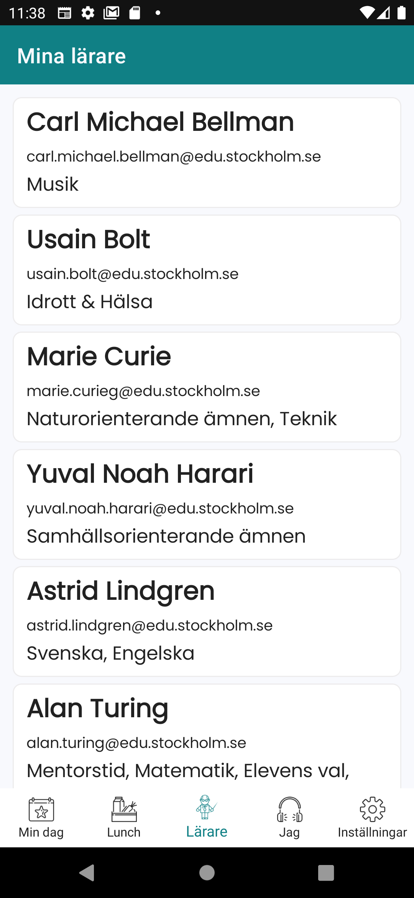

[en](README.md) | sv

# elev-app.net alias Öppna Elevappen

Öppna Elevappen är ett öppen källkod-projekt som möjliggör för elever att komma åt sin data på Skolplattformen, en digital plattform för skolor i Stockholm. Appen är byggd med .NET MAUI.

## Beskrivning

Öppna Elevappen är en enkel och intuitiv applikation som gör det möjligt för elever att enkelt komma åt sitt schema, kalendrar och andra detaljer om sin dag på Skolplattformen. Appen ger eleverna ett bekvämt och säkert sätt att komma åt sin data på språng.

## Bidra
Om du är intresserad av att bidra till utvecklingen av Öppna Elevappen välkomnar vi din hjälp! Här är några sätt du kan hjälpa på:

- Rapportera buggar och föreslå nya funktioner på [GitHub issue tracker](https://github.com/kolplattformen/elev-app.net/issues).
- Skicka pull-requests för att fixa buggar eller lägga till nya funktioner.
- Hjälp med dokumentationen.

Här finns lite hjälp för att [konfigurera din utvecklingsmiljö](CONTRIBUTE-sv.md)
