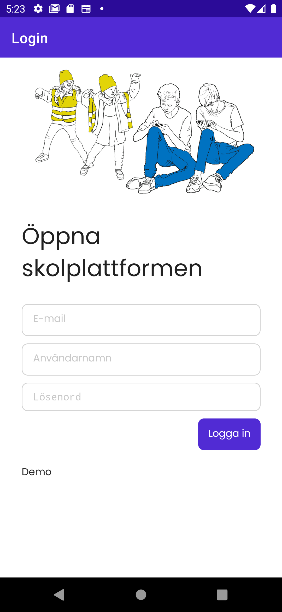
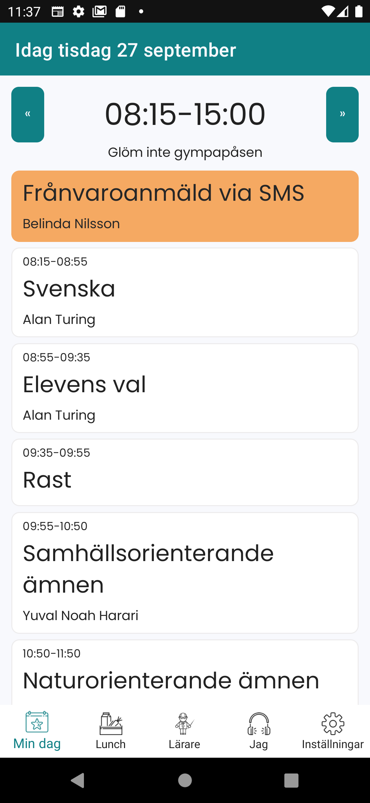
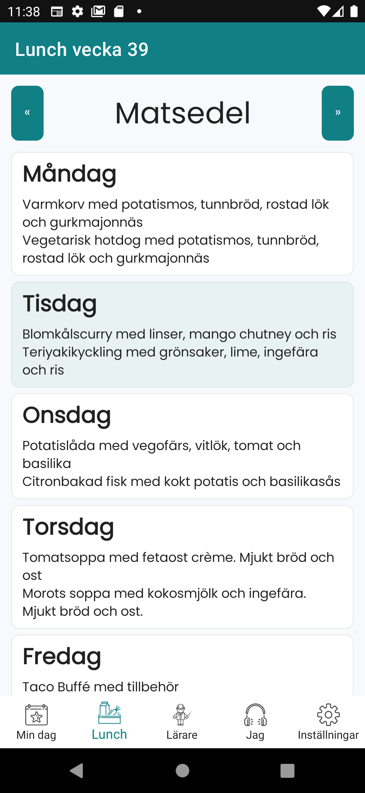
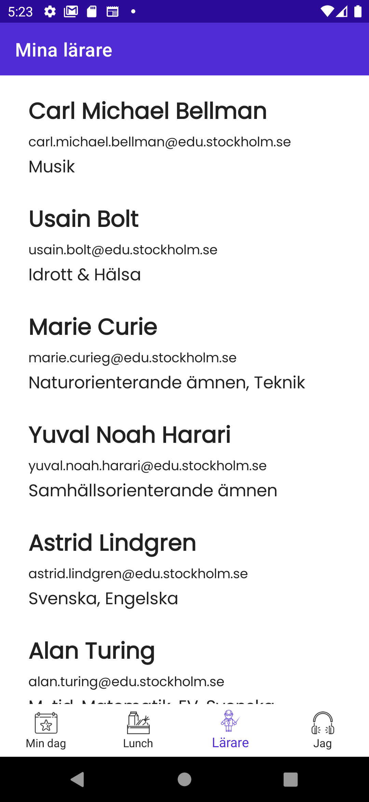

en | [sv](README-sv.md)

# elev-app.net aka Öppna Elevappen

Öppna Elevappen is an open-source project that allows students to access their data on Skolplattformen, a digital platform for schools in Sweden. The app is built with .NET MAUI.

## Description

Öppna Elevappen is a simple and intuitive application that enables students to easily access their timetable, calendars, and other details of their day on Skolplattformen. The app provides students with a convenient and secure way to access their data on the go.

## Contribute
If you're interested in contributing to the development of Öppna Elevappen, we welcome your help! Here are a few ways you can get involved:

- Report bugs and request features on the [GitHub issue tracker](https://github.com/kolplattformen/elev-app.net/issues).
- Submit pull requests to fix bugs or add new features.
- Help with documentation.

Here is some help to [setup your dev environment](CONTRIBUTE.md)